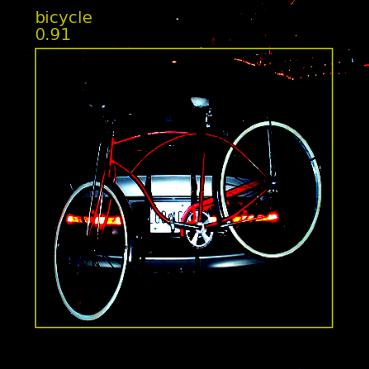
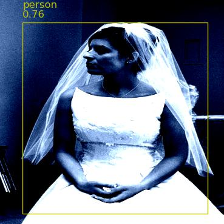
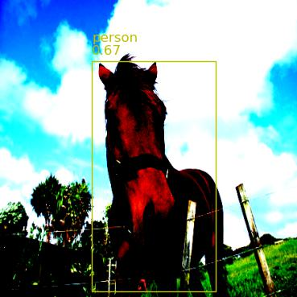

# yolo-v1

PyTorch implementation of YOLO v1.

## Environment setup
```
pip install -r requirements.txt
```

## Dataset
Trained and tested YOLO v1 on MS COCO dataset. Dataset was downloaded here https://www.kaggle.com/datasets/734b7bcb7ef13a045cbdd007a3c19874c2586ed0b02b4afc86126e89d00af8d2, and placed in **data** folder.

```
yolo-v1
├── data                 
    ├── images/            # folder of images
    ├── labels/            # folder of labels
    ├── train.csv          # csv that contains paths of train images and labels
    ├── test.csv           # csv that contains paths of test images and labels
```

## Train
To train:
```
python train.py
```

### Monitor Training Progress
To monitor progress:
```
tensorboard --logdir=runs
```


## Test
To test:
```
python test.py
```

### Performance
mAP values for val and test set are shown in the table below:
| Validation mAP@0.5 | Test mAP@0.5 |
|----------|----------|
| 0.1397 | 0.1426 |

Examples of good detections on test set:

  
  

Examples of bad detections on test set:

  
  

## Note to self
Remember to set bias=False for linear/conv layers right before batchnorm!
